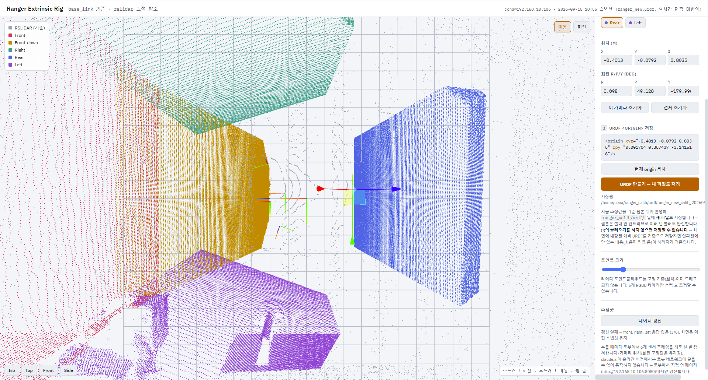

# ranger_calib

Ranger 로봇의 RGBD 카메라 외부 파라미터(extrinsic)를 브라우저에서 눈으로 맞추고, 그 결과를 URDF `<origin>` 으로 저장하는 도구입니다.

라이다(`rslidar`) 포인트클라우드를 고정 기준으로 두고, 5개 RGBD 카메라의 포인트클라우드를 마우스로 끌어 정렬합니다. 정렬이 끝나면 로봇이 실제로 쓰는 URDF 위에 조정값을 반영한 **새 URDF 파일**을 만들어 줍니다. 원본 URDF는 이 도구가 절대 수정하지 않습니다.

- 기준 좌표계: `base_link` (Z-up, ROS 규약)
- 편집 대상: `base_link` → `camera_*RGBD_link` 조인트의 `<origin>`
- 고정 참조: `rslidar` (회색 점, 드래그 불가)



위 화면은 `Rear` 카메라를 선택해 이동 기즈모로 조정 중인 상태입니다. 왼쪽은 3D 뷰(센서별 색상 범례 포함), 오른쪽은 작업 패널입니다. 하단의 갱신 상태 줄에 `갱신 실패 — front, right, left 응답 없음 (3/6)` 처럼 캡처 결과가 그대로 표시됩니다.

## 구성

| 파일 | 역할 |
| --- | --- |
| `calib_server.py` | 웹 UI 서버. 정적 파일 제공 + URDF 읽기/저장 + 스냅샷 갱신 트리거 |
| `capture_once.py` | 6개 센서 토픽을 한 번씩 캡처해 `data/*.json` 으로 저장 |
| `capture_loop.py` | 같은 캡처를 4초 주기로 반복 (서버 없이 계속 갱신할 때 사용) |
| `index.html` | 3D 정렬 웹 UI (three.js) |
| `urdf/` | 기준 URDF 및 저장 결과 URDF |
| `data/` | 캡처된 포인트클라우드 스냅샷 (JSON) |

## 요구 사항

실행은 **로봇 본체(ROS 2 노드가 도는 장비)** 에서 합니다. 캡처 스크립트가 ROS 토픽을 직접 구독하기 때문입니다.

- ROS 2 Humble (`/opt/ros/humble/setup.bash`)
- `rosbridge_server` 패키지 (별도 터미널에서 먼저 띄웁니다 — 아래 [실행](#실행) 참고)
- Python 3, `rclpy`, `numpy`, `sensor_msgs_py`
- 브라우저 (three.js를 CDN에서 받으므로 **UI를 여는 쪽은 인터넷 연결 필요**)

캡처 대상 토픽 6개:

```
/rslidar_points
/camera_frontRGBD/depth/points
/camera_fdownRGBD/depth/points
/camera_rightRGBD/depth/points
/camera_rearRGBD/depth/points
/camera_leftRGBD/depth/points
```

## 실행

터미널 2개를 씁니다. 1번은 rosbridge, 2번은 캘리브레이션 서버입니다. 둘 다 로봇에서 실행합니다.

### 터미널 1 — rosbridge

```bash
source /opt/ros/humble/setup.bash
ros2 launch rosbridge_server rosbridge_websocket_launch.xml
```

작업이 끝날 때까지 이 터미널은 켜 둡니다.

### 터미널 2 — 캘리브레이션 서버

```bash
git clone git@github.com:zeroworks-robotics/ranger_calib.git
cd ranger_calib
python3 calib_server.py
```

이 터미널은 ROS 환경이 필요 없습니다. `calib_server.py` 는 `rclpy` 를 쓰지 않는 순수 HTTP 서버이고, 캡처가 필요할 때마다 하위 셸을 띄워 그 안에서 `source` 와 `export` 를 직접 수행합니다.

기동 시 콘솔에 읽어온 실사용 URDF 경로가 찍힙니다. 여기가 `MISSING` 이면 `CONA_URDF_PATH` 설정이 잘못된 것이므로 UI를 열기 전에 먼저 고쳐야 합니다.

```
serving /home/cona/ranger_calib on :8080, POST /save_urdf writes into /home/cona/ranger_calib/urdf
live urdf: ../data/CoNA/urdf/ranger_new_a01.urdf  (src=ROBOT_SETUP) [ok]
```

브라우저에서 `http://<로봇 IP>:8080` 을 엽니다 (예: `http://192.168.10.106:8080`).

## 캘리브레이션 절차

웹 UI 오른쪽 패널의 ①②③ 순서를 그대로 따릅니다.

### ① 기준 원본 — 최신 URDF 불러오기

`최신 URDF 불러오기` 를 누릅니다. 로봇의 실사용 URDF를 그 자리에서 읽어와 화면과 기준값을 갱신합니다.

- **이 단계를 건너뛰면 ③의 저장이 잠긴 채로 풀리지 않습니다.** 페이지에 내장된 예비 URDF를 기준으로 저장하면 실파일에만 있는 링크(초음파 등)가 사라지기 때문에 의도적으로 막아 둔 것입니다.
- 작업 시작 전에만 누릅니다. 이미 조정한 값은 전부 버려지고 되돌릴 수 없습니다. 조정값이 있으면 확인을 위해 두 번 눌러야 실행됩니다.

### ② 카메라 선택

탭에서 조정할 카메라를 고릅니다: Front / Front-down / Right / Rear / Left. 라이다는 선택 대상이 아닙니다.

### 정렬

3D 뷰에서 선택한 카메라의 포인트클라우드를 라이다 점군에 겹치도록 맞춥니다.

| 조작 | 동작 |
| --- | --- |
| 좌 드래그 | 시점 회전 |
| 우 드래그 | 시점 이동 |
| 휠 | 줌 |
| `G` / `이동` 버튼 | 기즈모를 이동 모드로 |
| `R` / `회전` 버튼 | 기즈모를 회전 모드로 |
| `Iso` `Top` `Front` `Side` | 고정 시점 전환 |

패널의 `위치 (m)` / `회전 R/P/Y (deg)` 입력란에 숫자를 직접 넣어 미세 조정할 수도 있습니다. 되돌릴 때는 `이 카메라 초기화` 또는 `전체 초기화` 를 씁니다. `포인트 크기` 슬라이더로 점 크기를 바꿉니다.

점군이 오래되어 보이면 `스냅샷` 항목의 `데이터 갱신` 을 누릅니다. 로봇에서 6개 센서 프레임을 새로 한 번 캡처하며, 조정 중인 위치/회전 값은 유지됩니다. 6개 전부 성공해야 성공으로 표시되고, 일부만 들어오면 실패로 보고합니다 — 오래된 점군에 맞춰 보정하는 사고를 막기 위한 동작입니다.

### ③ URDF 저장

`현재 origin 복사` 로 `<origin>` 텍스트만 가져갈 수 있고, `URDF 만들기 — 새 파일로 저장` 을 누르면 서버가 `urdf/` 밑에 두 개를 씁니다.

```
urdf/<원본이름>_calib_<YYYYMMDD_HHMMSS>.urdf   # 이력용 타임스탬프 파일
urdf/<원본이름>_latest.urdf                     # 항상 최신 결과
```

원본 URDF는 건드리지 않으므로 여러 번 눌러도 안전합니다. 로봇에 실제로 반영하려면 결과 파일을 `CONA_URDF_PATH` 가 가리키는 위치로 직접 복사하고 관련 노드를 재시작하십시오.

## 서버 없이 캡처만 하기

점군 스냅샷만 갱신하려면 캡처 스크립트를 직접 돌립니다.

```bash
source /opt/ros/humble/setup.bash
export ROS_DOMAIN_ID=18
export RMW_IMPLEMENTATION=rmw_cyclonedds_cpp

python3 capture_once.py    # 1회 캡처 (최대 8초 대기)
python3 capture_loop.py    # 4초 주기로 계속 갱신 (Ctrl+C 로 종료)
```

`capture_once.py` 는 토픽별 결과와 합계를 출력합니다. 서버는 이 출력의 `DONE` 줄을 보고 성공 여부를 판정합니다.

```
RESULT rslidar_points: OK
...
DONE 6/6
```

캡처 동작 요약:

- 센서당 최대 20,000점까지 무작위 추출 (`MAX_POINTS`)
- 원점에서 0.05 m 이내의 점은 무효 깊이 픽셀로 보고 제거 (`MIN_RANGE`). RGBD 드라이버가 무효 픽셀을 NaN이 아니라 `(0,0,0)` 으로 내보내므로 `skip_nans` 만으로는 걸러지지 않습니다.
- BEST_EFFORT / RELIABLE QoS 양쪽을 동시에 구독해 드라이버 설정 차이를 흡수합니다.
- 좌표값은 소수 4자리로 반올림한 평탄 배열(`[x,y,z,x,y,z,...]`)로 저장합니다.
- `.tmp` 에 쓰고 `os.replace` 로 교체하므로, 읽는 쪽이 반쯤 쓰인 파일을 보는 일은 없습니다.

## 설정

| 환경변수 | 기본값 | 용도 |
| --- | --- | --- |
| `RANGER_CALIB_PORT` | `8080` | 웹 서버 포트 |
| `CONA_URDF_PATH` | (기체 설정파일에서 읽음) | 실사용 URDF 경로. 상대·절대 경로 모두 허용하며 디렉터리를 줘도 됩니다 |
| `ROBOT_SETUP` | `/etc/coga-robotics/cona/setup.bash` | `CONA_URDF_PATH` 를 찾을 기체 설정파일 |

URDF 경로 결정 순서:

1. 환경변수 `CONA_URDF_PATH`
2. `ROBOT_SETUP` 파일을 `bash` 로 source 해서 얻은 `CONA_URDF_PATH`
3. 폴백 `../data/CoNA/urdf/ranger_new_a01.urdf`

2번 경로가 필요한 이유: `.bashrc` 는 비대화형 셸에서 조기 return 하므로 systemd나 ssh로 서버를 띄우면 `CONA_URDF_PATH` 가 프로세스 환경에 실려 오지 않습니다.

저장 파일명은 실사용 URDF 이름을 그대로 따라갑니다. 기체가 `a01` → `a02` 로 바뀌면 코드를 고치지 않아도 결과 파일명이 같이 따라옵니다.

## HTTP API

| 메서드 | 경로 | 동작 |
| --- | --- | --- |
| `GET` | `/latest_urdf` | 실사용 URDF 원문 반환. 응답 헤더 `X-Live-Urdf` 에 실제 파일명 |
| `POST` | `/refresh_snapshot` | `capture_once.py` 실행. 6개 전부 성공 시 `200`, 부분 성공/실패 `500`, 15초 초과 `504` |
| `POST` | `/save_urdf` | 본문(URDF 전문)을 `urdf/` 밑에 타임스탬프 파일 + `_latest` 로 저장. 응답 본문은 저장 경로 |
| `GET` | 그 외 | 저장소 디렉터리의 정적 파일 (`index.html`, `data/*.json`) |

## 문제 해결

**서버 로그에 `live urdf: ... [MISSING - CONA_URDF_PATH 를 확인하세요]`**
`CONA_URDF_PATH` 가 없는 파일을 가리킵니다. UI의 `최신 URDF 불러오기` 가 실패하고 저장도 잠긴 상태로 남습니다. 경로를 고친 뒤 서버를 재시작하십시오.

**`URDF 만들기` 버튼이 계속 비활성**
①의 `최신 URDF 불러오기` 를 누르지 않았습니다. 의도된 잠금입니다.

**`데이터 갱신` 이 실패 / `DONE 4/6`**
해당 센서 토픽이 안 나오고 있습니다. `ros2 topic hz /camera_rearRGBD/depth/points` 등으로 퍼블리시 여부와 `ROS_DOMAIN_ID`(18), `RMW_IMPLEMENTATION`(`rmw_cyclonedds_cpp`) 설정을 확인하십시오.

**3D 뷰가 빈 화면**
three.js를 CDN(`cdnjs.cloudflare.com`, `cdn.jsdelivr.net`)에서 받습니다. 페이지를 여는 쪽 네트워크가 외부로 못 나가면 렌더링되지 않습니다.

**포인트클라우드는 보이는데 갱신이 안 됨**
로봇이 아닌 곳에서 열린 페이지(예: 파일로 복사한 `index.html`)는 로봇 네트워크에 닿지 못해 `데이터 갱신` 이 동작하지 않습니다. 반드시 로봇에서 서비스하는 주소로 접속하십시오.
